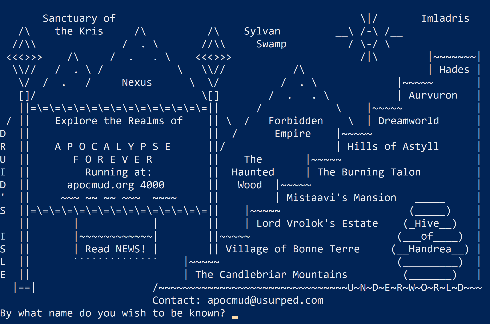

I was invited to include something in the [#WeAreOLC](https://onlinelearningconsortium.org/weareolc-the-power-of-storytelling-at-accelerates-25th-anniversary/) collection of narratives. Each of the posts in the series uses the same sort of framework: a few topics to get you started. So, without getting *too* wordy, here they are:

## How did you first get involved with the OLC??

I first got involved because of the inimitable [Angela Gunder](https://twitter.com/angelagunder), as is the case for so many, I've no doubt. I submitted an Innovation Studio talk/workshop/thing for the [2017 OLC Innovate conference in New Orleans](https://ryanstraight.com/2017/07/26/olc-innovate-2017/). I got to talk about using Slack in online programs (something I'm still doing), which was a lot of fun. I also ended up working in the Lab, getting to wear the white lab coat and talk to folks about the cool stuff they were doing or wanting to do.

Plus, it was in New Orleans, so. Yeah.

## 25 years (then and now): What kinds of technology were you using 25 years ago and what technology do you engage with now?

So what was I doing 25 years ago in 1994? Well, I was in 7th grade. That's actully pretty hard to believe. For me, I mean. You probably have no feelings on it one way or another. 

Anyway, back then I had a Packard Bell computer. It had a 4x CD-rom drive and, if I recall correctly, 420M of harddrive space. I remember my friends being very impressed by this and claiming I'd "never fill that up!" (Spoiler: I did.)

I played Doom and Descent and Hexen and Heretic and a MUD called "Apocalypse" (which, holy crap, [is totally still around](http://thewoodedglen.com/attn-apoc-mudders/)) and all was right with the world.

```{r echo=FALSE}
library(knitr)

```

The technology I engage with now is... well, just browse this site. It's everywhere. My field is **human-computer interaction**, after all!

## What is one of your favorite OLC experiences?

I don't think I can peg just one down, and that's because of the next prompt: my favorite OLC experience has been the building of that community. Making the friends I've made. Sharing the times I've shared. Seeing everyone involved being better for it.

## Who composes your OLC community?

I've met people through OLC that I most likely never would have met otherwise and I am so grateful for it that it borders on weepy. The community has not just been a PLN but a group of friends that I always look forward to seeing whenever I get the chance. In fact, we all went in together on a more formalized (if informal... it's unique) PLN called the **SquadGoalsNetwork** and ended up winning an OLC Effective Practice Award for it. Not too shabby!

I get to work with OLC a lot and it's really opened me up to a huge collection of wonderful people and great opportunities. I look forward to continuing to do so in the future.

<div style="width:100%;height:0;padding-bottom:77%;position:relative;"><iframe src="https://giphy.com/embed/awxqzKhiUV4ly" width="100%" height="100%" style="position:absolute" frameBorder="0" class="giphy-embed" allowFullScreen></iframe></div><p style='font-size:50%'><a href="https://giphy.com/gifs/funny-lol-game-boy-awxqzKhiUV4ly">via GIPHY</a></p>

And yeah, me too, kid.
