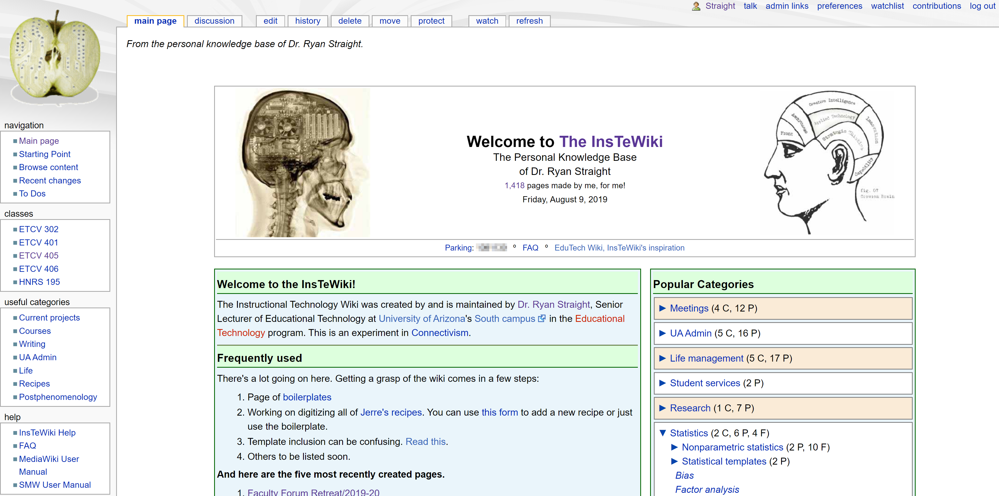
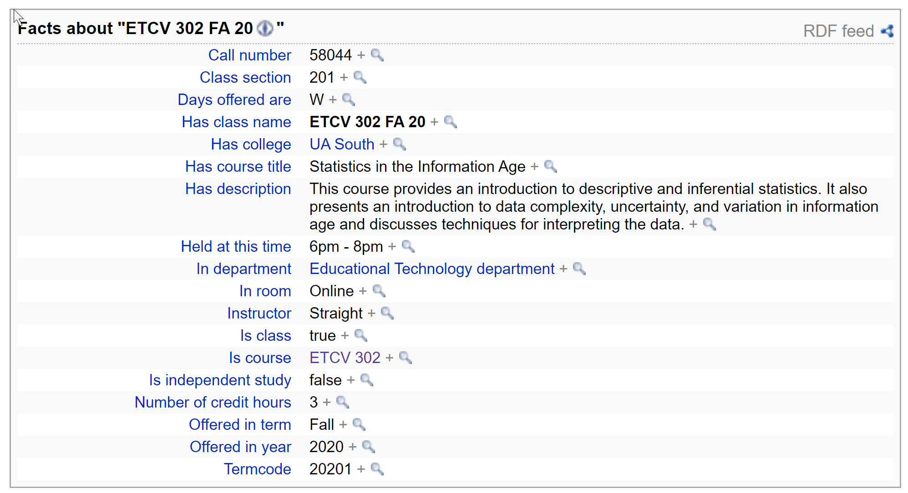
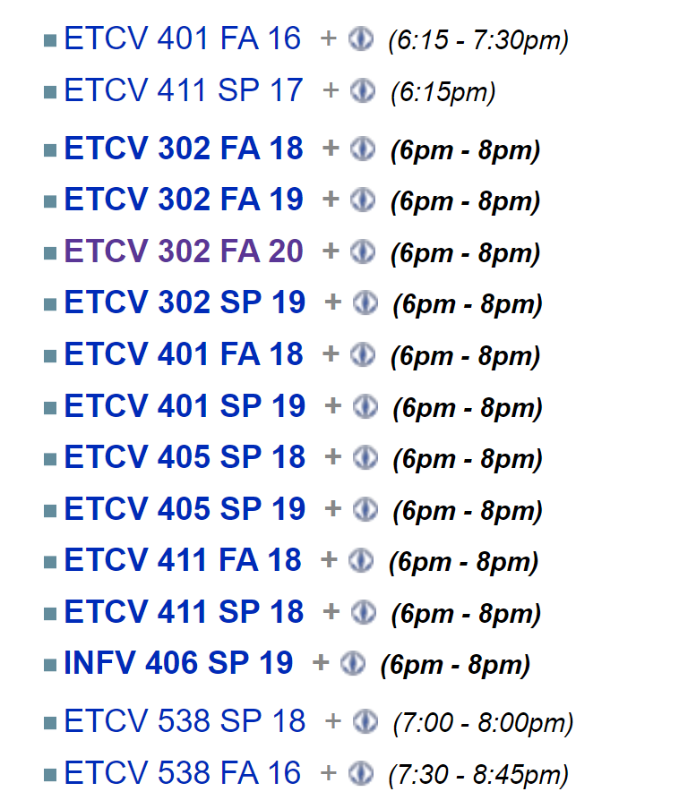
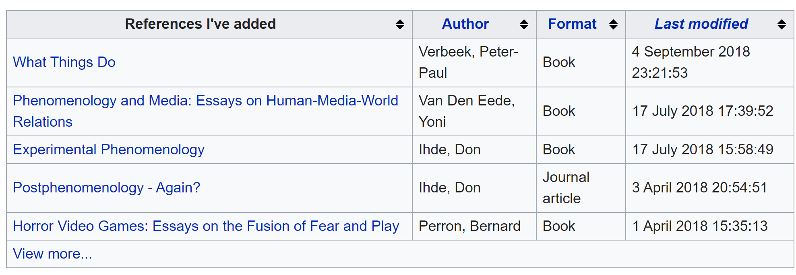
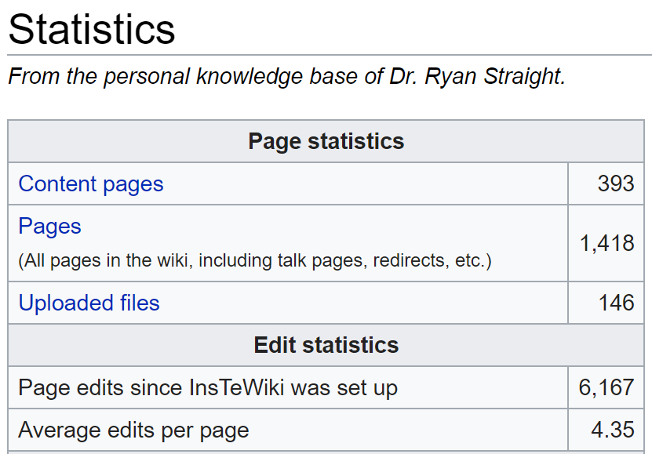

-----

My personal knowledge base (PKB) is turning 10 years old this December. Back in graduate school, I wanted a way to keep track of not just resources and references and miscellany, but also a way to kind of keep my life organized. It's actually something I talked about [back in an episode of my podcast, The New Professor](https://thenewprofessor/019/). You can have a listen here:

<audio src="https://s3-us-west-1.amazonaws.com/thenewprofessor.com/mp3s/TNP_Ep019.mp3" controls="controls">
Your browser does not support the audio element.
</audio>

Some folks have expressed an interest in seeing how I go about setting up and actually using my PBK. So, I figured, let's write it up! 

## The Platform

I've always liked wikis. The interconnectedness of knowledge (can you tell I'm a Connectivism fan?) is easy to follow and fairly well mimics the way our brains work in that we can bounce between related topics quickly. For that reason (and to force myself to learn how to work with PHP and SQL), I decided to start my own MediaWiki.

Back then, in 2009, I was still very, very new at this. I had no idea that I could run the wiki locally on my own machine, so I bought some web space and threw it on there. There are [pretty detailed instructions](https://www.mediawiki.org/wiki/Manual:Running_MediaWiki_on_Windows) on the MediaWiki website on how to set up a local wiki, so I won't go into that here. So, go on over there, get it installed, and come back. I'll wait.

## Appearance

I'm big on making things look nice, even when they're just for me. As such, I modeled the main page on my wiki after [EduTech Wiki](http://edutechwiki.unige.ch/en/Main_Page) with some obvious stylistic changes.



I should note here that when I started this back in 2009, I had planned on letting other people use it. Since then I've made it just for myself. So, that's why some language you'll see there sounds like it's for more than just me.

## Extensions

I use a number of extension to make it much more useful for me. It turns out that most of the ones I still use today are included in [the Semantic Bundle](https://www.semantic-mediawiki.org/wiki/Help:Semantic_MediaWiki_extensions), which I'll address in a minute. Here are the ones that _aren't_ included:

+ MaintenanceShell
+ Newest Pages
+ Page Forms
+ SpecialNamespaces
+ WikiEditor
+ CategoryTree
+ Cite
+ CodeMirror
+ InputBox
+ Lingo
+ MyVariables
+ ParserFunctions
+ DataValuesValidators
+ MultiBoilerplate
+ ParserHooks

### Semantic MediaWiki

The [Semantic MediaWiki (SMW) package](https://www.semantic-mediawiki.org/wiki/Semantic_MediaWiki) is what really makes this whole thing so useful.

>Allows users to add structured data to wiki pages through simple wikitext markup that turns links to other pages and data values in a page into meaningful properties. With this information, SMW helps to search, organize, browse, evaluate, and share the wiki's content.

This is probably easier to demonstrate than just explain. We can take a look at one of my class pages.

Using a combination of boilerplates and templates, I can easily start a new page for a class offering. We'll actually go through my fall 2019 INFV 302 class here.

I load this `Course` boilerplate (that I created):

```mediawiki
{{Infobox course
<!--'''DON'T WORRY ABOUT THE ALIGNMENT OR AMOUNT OF WHITE SPACE.''' -->
<!-- If you are entering a quarterly class rather than a general course, you may omit the fields marked with a star (*). They will be pulled from the course equivalent. -->
| course     =                    <!-- This is the course prefix and number, such as EDCT 203 or MATH 113. -->
| prefix     =                    <!-- * Place the prefix here again for semantic searches. EDCT or MATH or P SC,  whatever it may be.  -->
| longname   =                    <!-- * The long name of the course goes here. Introduction to Philosophy of  Religion for example. -->
| desc       =                    <!-- * The full description of the course goes here. Make sure there are no line breaks, as it breaks the infobox. -->
| college    =                    <!-- * Place the college the course belongs to here. College of Education  or College of Communication for example.  -->
| dept       =                    <!-- * Department in which the class is located. Linguistics or Educational  Studies for example. (The trailing "department" is added automatically.) -->
| year       =                    <!-- This is the year offered. Remember, Fall of 2004 is considered part of  the 2005 school year. -->
| term       =                    <!-- Choose between: Fall, Winter, Winter Intersession, Spring, Summer (full), Summer (1st session) and Summer (2nd session) -->
| days       =                    <!-- The days offered. For example, Thursday or M T R F or Tu Th will  work.  -->
| time       =                    <!-- Time of day the class is offered. 5pm - 9pm works just fine.  -->
| room       =                    <!-- Room the class took place in. Should be building and room number: Morton  201 or Ellis 014 -->
| hours      =                    <!-- * Number of credit hours. Numerical or written out, either is fine (5 or  five).  -->
| call       =                    <!-- Call number for the course (five digit number): 01234 -->
| section    =                    <!-- Section for the course. Normally A01 but can be any combination (X01 for  online courses, for example). -->
| instructor =                    <!-- Instructor of record, without honorific. (Denis Leary rather than  Dr. Leary)  -->
| syllabus   =                    <!-- Link to the syllabus file (PSY 101 Winter 2005 syllabus.doc for  example; can upload afterward by clicking on the red "Syllabus" link) -->
| istudy     =                    <!-- Is this an independent study? This field is boolean, so Yes/No, True/False, 1/0 works, whatever you like. -->
| text1      =                    <!-- Title of first text used. Make this the full-title of text with proper  capitalization as this will link to a page on the wiki for that text. -->
| text2      =  
| text3      =  
| text4      =  
| text5      =  
| text6      =  
| text7      =  
| text8      =  
| text9      =  
| text10     =  
}}
```
Again, some of the comments there are out of date but I deal. In the event that I'm doing a class entry for INFV 302, as long as I put `INFV 302` in the "Course" field, it will match the rested of the non-semester-specific data to that page's information, shortening the amount of work to create the page. I just have to fill in the term-specific content (days, times, room, call number, etc). This creates an infobox on the class page (which is handy and looks like) but also creates a _lot_ of semantic data that I can use later to filter, find, analyze, etc, my classes.

If you're curious, here's the template code for that page:

```mediawiki
<includeonly>{|style="float:{{{align|right}}}; clear: right; width:{{#if:{{{width|}}}|{{{width|}}}|264px}}; text-align:left; border:1px solid darkgray;" cellspacing="0" cellpadding="3"
|-
! colspan=2 style="background:#DDDDDD; font-style:italic; font-size:120%; text-align:center;" class="summary" | [[Is course::{{{course}}}]]{{#if:{{{term|}}}| &nbsp;({{{term}}}}}{{#if:{{{year|}}}| &nbsp;{{{year}}})}}
|-
|colspan=2 style="text-align:center;" {{#if:{{{longname|}}}| {{!}} [[Has course title::{{{longname|}}}]]| {{!}} [[Has course title::{{#show:{{{course}}} | ?Has course title =}}]] }}
|-
|colspan=2 style="text-align:center; border-bottom:1px solid darkgray;" {{#if:{{{desc|}}}| {{!}}<span style="font-size: .75em;">{{{desc|}}}</span>{{#set:has description={{{desc}}}}}| {{!}}<span style="font-size: .75em;">[[Has description::{{#show: {{{course}}} | ?Has description# =}}]]</span>}}
{{Alternating rows table section
|es=background:#DDDDDD;
|{{#if:{{{college|}}}| {{!}} '''College''' {{!!}}[[Has college::{{{college|}}}]] | {{!}} '''College'''  {{!!}} [[Has college::{{#show:{{{course}}} | ?Has college# =}}]] }}
|{{#if:{{{dept|}}}| {{!}} '''Department''' {{!!}}[[In department::{{{dept|}}} department{{!}}{{{dept|}}}]]| {{!}}  '''Department''' {{!!}}[[In department::{{#show:{{{course}}} | ?In department# =}}]] }}
|{{#if:{{{year|}}}| {{!}} '''School year''' {{!!}}  [[Offered in year::{{{year|}}}]] }}
|{{#if:{{{term|}}}| {{!}} '''Term''' {{!!}} [[Offered in term::{{{term|}}}]] }}
|{{#if:{{{days|}}}| {{!}} '''Days''' {{!!}} [[Days offered are::{{{days}}}]] }}
|{{#if:{{{time|}}}| {{!}} '''Times''' {{!!}} [[Held at this time::{{{time|}}}]] }}
|{{#if:{{{room|}}}| {{!}} '''Room''' {{!!}} [[In room::{{{room|}}}]] }}
|{{#if:{{{hours|}}}| {{!}} '''Credit hours''' {{!!}} [[Number of credit hours::{{{hours|}}}]]|{{!}} '''Credit hours'''  {{!!}}  [[Number of credit hours::{{#show:{{{course}}} | ?Number of credit hours =}}]] }}
|{{#if:{{{section|}}}| {{!}} '''Section''' {{!!}} [[Class section::{{{section|}}}]] }}
|{{#ifeq:{{SUBPAGENAME}}|Infobox course/boilerplate||{{#if:{{{call|}}}| {{!}} '''Call number''' {{!!}} [[Call number::{{{call|}}}]]{{#set:is class=true}}{{#set:has class name={{FULLPAGENAME}}}}[[Category:Classes]]|{{#set:is class=false}}[[Category:Courses]]}} }}
|{{#if:{{{instructor|}}}| {{!}} '''Instructor''' {{!!}} [[Instructor::{{{instructor|}}}]] }}
|{{#if:{{{syllabus|}}}| {{!}} '''Syllabus''' {{!!}} {{#set:Has syllabus=yes}}[[Media:{{{syllabus|}}}{{!}}Syllabus]] }}}}{{#if:{{{text1|}}}| {{!}}-
{{!}}colspan=2 style="text-align:center;" {{!}}  '''Texts'''
{{!}}-
{{!}}colspan=2 {{#if:{{{text1|}}}| {{!}}  [[Has textbook::{{{text1|}}}]] }}{{#if:{{{text2|}}}| ,  [[Has textbook::{{{text2|}}}]] }}{{#if:{{{text3|}}}| ,  [[Has textbook::{{{text3|}}}]] }}{{#if:{{{text4|}}}| ,  [[Has textbook::{{{text4|}}}]] }}{{#if:{{{text5|}}}| ,  [[Has textbook::{{{text5|}}}]], }}{{#if:{{{text6|}}}| ,  [[Has textbook::{{{text6|}}}]], }}{{#if:{{{text7|}}}| ,  [[Has textbook::{{{text7|}}}]], }}{{#if:{{{text8|}}}| ,  [[Has textbook::{{{text8|}}}]], }}{{#if:{{{text9|}}}| ,  [[Has textbook::{{{text9|}}}]] }} {{#if:{{{text10|}}}|  and [[Has textbook::{{{text10|}}}]] }}}}
|}<!-- Everything after this is to improve semantic searching --><!-- Switches term name to a number for term coding -->
{{#if:{{{term|}}}|{{#switch: {{{term|}}}
| Fall = {{#set:termcode={{{year}}}1}}
| Winter = {{#set:termcode={{{year}}}2}}
| Winter intersession = {{#set:termcode={{{year}}}2}}
| Spring = {{#set:termcode={{{year}}}3}}
| #default = {{#set:termcode={{{year}}}4}}
}}|}}<!-- If the course has a call number and is  not an independent study, this adds a link to a page in your namespace  for notes -->{{#if:{{{call|}}}|{{#ifeq:{{{istudy|}}}|yes||{{YourClassNotes}}}}}}
<!-- Sets independent study flag -->{{#if:{{{istudy|}}}|{{#set:is independent study={{{istudy|}}}}}|{{#set:is independent study=false}}}}
<!-- If the course listing doesn't have a call number this tells the wiki it's a course and not a class and tells it to list related classes and what textbooks have been used in all those classes. -->{{#if:{{{call|}}}||{{Likecourse}}

{{Coursetexts}}}}
</includeonly><noinclude>
{{Template:Infobox_course/doc}}
[[Category:Templates]]</noinclude>
```
So what does all this do for me? Take a look at the `room` line: `|{{#if:{{{room|}}}| {{!}} '''Room''' {{!!}} [[In room::{{{room|}}}]] }}`

In this case, if I add a room number (or anything in that field, like "Online"), the semantic code, `[[In room:: ... ]]` adds a property to that page with the `In room` value. Same for number of hours, same for days of the week the class is offered, and so on.

And what does _that_ mean? Well, first let's see all the semantic data this template created:



See the `Held at this time` property? In this class, that's given the value of `6:00pm - 8:00pm`. If I want to see what other classes I've taught that were also held at that time, I can just click the magnifying glass and I get this:




But wait, there's more!

This is cool and all, having that sort of identifiable and meaningful data, but where it really comes in handy is writing queries to get some really useful information.

### Queries

So, I have a template that I've written for pages I add to the wiki for books or research material that I really, really want to delve deeply into and go beyond just having Zotero notes and whatnot. Those individual reference pages have a template much like the Course pages, in which I include bibliographic information, format, notes, links to other content, and so on.

```mediawiki
{{#ask:[[was created by::{{PAGENAME}}]]
|mainlabel=References I've added
|?was written by=Author
|?format=Format
|?modification date=Last modified
|sort=Modification date
|order=desc
|format=broadtable
|limit=5
|searchlabel=View more...
```

[The `#ask` function](https://www.semantic-mediawiki.org/wiki/Help:Semantic_search) lets you look through pages on the wiki and pull out any of that semantic content. For this query, since I have this on my user page, I'm looking for any page in the wiki that was written by me (hence, `was created by::{{PAGENAME}}`, `PAGENAME` being equal to my username).

It grabs every page with that data (which is an included semantic annotation in my "Reference" template), pulls all of them into a table, includes the format of the reference (book, article, etc), the author, when I last modified that page, limits the table to the 5 most recent pages, and includes a link to view the rest of the search.



(As you can see, I've been neglecting putting my research notes in the wiki, a practice I'm determined to return to.)

I do something very similar with a to-do list, wherein, on each term-based class page, I keep track of things I need to do for the next time I teach it. Those to-dos are embedded with semantic content, so I can then build a query that shows me all of the to-dos I need to take care of for the next semester's classes _regardless of when it is_. 

At this point, it's just a matter of actually using the thing. It's nice for the research content because you can easily identify cross-references with not just links but semantic relationships like `[[references but doesn't cite:: ... ]]` or `[[was mentee of:: ... ]]` or `[[relies heavily on:: ... ]]` or even `[[neglected to cite:: ... ]]`. Imagine the kind of 30,000ft view you could get of your entire body of literature if you take the time to do this. Pretty powerful, if you ask me.

This is just scratching the surface of what's capable, so I encourage you to just play with it. Of course, sketching out a basic skeleton of how you'd like to organize things will go a long way toward keeping you sane. For example, for my class pages, I have the following kind of breakdown, where the sub-pages are actually sub-pages of the Course page (since that content doesn't change from class to class, just gets updated and the updated version is what's always used):

|   Course 	|          Class 	|                      Sub-pages 	|
|---------:	|---------------:	|-------------------------------:	|
| INFV 302 	| INFV 302 FA 19 	|           Week 1: Introduction 	|
|          	|                	|        Week 2: Research Design 	|
|          	|                	|                            ... 	|
| INFV 401 	| INFV 401 FA 19 	| Module 1: The Conceptual Model 	|
|          	|                	|             Module 2: Personas 	|
|          	|                	|                   (and so on) 	|

So for the class pages the URL would just be `/wiki/w/index.php/INFV_302_FA_19` but the individual week/module pages with lecture notes, slide deck links, discussion prompts, etc, would be at `/wiki/w/index.php/INFV_302/Week_1:_Introduction`. The term-specific pages are *just* term-specific and contain content like notes about the teaching of the class, reminders for weird dates, and reflections on what could be done better next time. 
 
## What else?
 
Well, I used to sync the wiki data between machines using Resilio Sync, but that caused problems with the database getting out of sync and time codes bringing the entire thing down. It worked for a long time but the system was so fragile that I gave up on that. Single location is better than nothing at all.
 
I use the wiki for much more than just work. I keep track of my workouts, books that I want to get from the local bookshop, details on software or code that I _always_ forget, the digitization and archiving of recipes handed down through the family, woodworking projects, my side-hustles (like the soon-to-be-released YouTube channel on body modification, Inkademic), even our wedding plans from a year and a half ago. 

As everything is local, I tend to storage images and files elsewhere and just link to them (Tresorit is a favorite of mine for its privacy and encryption). 



There were long periods of time where I didn't use this. Mostly when I'd given up on finishing my PhD and has resigned myself to working in IT. The way it's set up now took _years_ to get right. Hell, it's not even right, now. I'm tweaking it, constantly. I stole lots and lots of templates and styles from Wikipedia to mimic the look. The key with using a system like this is *persistence*. You have to keep using it, obviously.

Anyway, I hope this was useful to folks. Of course, if you want to put something like this online and allow collaboration, as it's intended, there's nothing stopping you. This is just my way of doing it because it's only for me and you never know, y'know?
