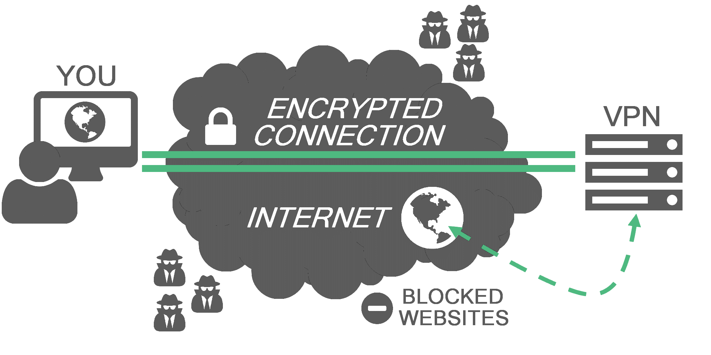

A little while back I was involved in a Twitter thread in which I suggested the [Brave browser](https://brave.com) for its integrated privacy and security settings.



That's fairly striking, I know.



So, here it is: my "So You Want To Be Safer In 2020" post! I'll preface it with this: this is _my_ opinion based on the products and services I know. Does it mean this is 100% the best way to go about it or there aren't potentially better options out there? Not at all. But if you want to hear firsthand experience, you've come to the right spot.

## What do you mean, "low-hanging fruit?"

One of the topics I address pretty heavily in my classes is the importance of finding a balance between usability and security. As the old joke goes, "The most secure system is one you can't access." This isn't what I'm addressing here today but it does lead us down this road: what are the simple solutions you can choose that will have the least impact on your day-to-day user experience? Some of these are simpler than others but I think everything below is definitely worth looking into. Note that I'm not affiliated with any of these products or services, though you may find the occasional affiliate link.

Now. First things first:

## Internet traffic, generally: get yourself a VPN

You've probably heard the term before. VPN stands for **V**irtual **P**rivate **N**etwork. The way it works is basically like this:

A VPN creates an encrypted (read: secure) line between you and the internet. Traffic from your computer goes through the VPN before it gets anywhere else and vice versa. This protects you from, among other things, snooping by your internet service provider (ISP), tracking/identification by the websites you visit, and unwanted incoming connections. It also anonymizes you to the rest of the world (within reason; if you sign into a website that will give the game away, of course) and allows you to get around government or other blocks.

### Why is this low-hanging fruit?

Because of its relative simplicity to use. It looks and sounds complicated but these days it's as simple as signing up for the service, installing the app, and ... well, that's about it. Most commercial VPNs will run perfectly fine just out of the box, though you can tweak some settings (like where you _look_ like you're geographically located and whether or not you want X app or Y app to bypass the VPN connection -- handy for Netflix since they block most proxies/VPNs).

### My pick: [Private Internet Access](https://amzn.to/2YvkbtB)

They're cheap, fast, and work on virtually any device. You can purchase any number of service lengths (monthly, annually, etc.) on their website or just get a [one-year subscription here](https://amzn.to/2YvkbtB). 

-----

## Web tracking and ads: change your browser & search engine

Most of our online lives are lived in web browsers and social media apps, it seems (and we'll come back to the latter in a bit). That said, it only stands to reason that your online experience is only as good as your browser. Chrome currently stands as the browser king with [roughly 65% of the browser market share](https://en.wikipedia.org/wiki/Usage_share_of_web_browsers#Summary_tables). 

### Why is this low-hanging fruit?

Mostly because of my pick for an alternate browser. It's the same experience but with increased security and privacy. And that is...

### My picks: [Brave](https://www.brave.com) and [DuckDuckGo](http://duckduckgo.com/)

See, Brave is actually a version of Chrome. Anything you can do in Chrome, you can do in Brave. It's actually built on [Chromium, the open-source platform that makes Chrome possible](https://www.howtogeek.com/202825/what%E2%80%99s-the-difference-between-chromium-and-chrome/). 

Brave has built-in ad blocking and privacy controls. When these features are enabled, Brave refers to it as being _shields up_ (though it does break some websites, so switching to _shields down_ is occasionally necessary but it'll be obvious when that's the case). Here's what happens if you visit, say, Buzzfeed:

And that's not even nearly the worst perpetrator I can think of, it was just a random popular website that came to mind.

There's also the whole Brave Rewards program and a built-in version of cryptocurrency called the Basic Attention Token (BAT) that can be used to tip websites that have enabled it but that's another post. Feel free to [throw a tip my way](https://brave.com/tips/) if you're using it, though!

As for the search engine, just moving away from Google is a huge step (because nobody actually uses Bing, let's be honest). My typical go-to for search engines is [DuckDuckGo](http://duckduckgo.com/) (which, ironically, _does_ use Bing's results along with many, many others). It's easy to [switch your default browser search engine in Brave](https://support.brave.com/hc/en-us/articles/360017479752-How-do-I-set-my-default-search-engine-) and their private windows (like Incognito in Chrome) uses it automatically. If you're interested in using Google's results, [you can try StartPage](https://www.startpage.com/), instead, which is also a great choice.

-----

## Credentials: use a password vault and 2FA

I cannot emphasize this enough: use long, unique passwords for everything and enable two-factor authentication everywhere you can. Let's have a little thought experiment, shall we?

You've been using the same email and password for everything for years. Let's say it's `password1`. (Think that's too obvious? It doesn't even [crack the top 20](https://www.welivesecurity.com/2018/12/17/most-popular-passwords-2018-revealed/) of the most popular passwords.) So you've been using that password everywhere from your university email to Netflix to the bank to a silly little website you don't even remember signing into a couple years ago.

Is it likely your university or your bank or Netflix is going to find their entire user database of credentials obtained and leaked? Nah, probably not. That's not how these things typically go. What will usually happen is that little website you signed up for (and probably even forgot about) gets hacked and, because they didn't know what they were doing, kept all their users' emails and passwords in plain text right there on the server. (Sound unlikely? [It's what Facebook did for years](https://krebsonsecurity.com/2019/03/facebook-stored-hundreds-of-millions-of-user-passwords-in-plain-text-for-years/).) So while your email and bank and Netflix weren't hacked, someone--and, likely, anyone who wants to search the [half-billion passwords](https://haveibeenpwned.com/Passwords) that've been exposed online--now has those credentials because they're the same everywhere. So, all that person has to do in theory is take that email and password combination, start visiting popular websites, and eventually they're going to get lucky.

That is a true nightmare just waiting to happen. That particular nightmare could've been avoided by just using different passwords for everything. But who wants to keep track of all those, right? Well.

### Why is this low-hanging fruit?

Because services like the ones I've chosen for my picks are so dead simple to use that the tiny learning curve is absolutely justified by the benefits of using the services. 

### My picks: [LastPass](https://lastpass.com) and [Authy](https://authy.com)

Both are both browser extensions and stand-alone phone apps. LastPass keeps track of all those passwords for you, even updates automatically when you need or decide to change your password. It can generate passwords as long and as complex as you need. It even provides what they call the [_Security Challenge_](https://helpdesk.lastpass.com/lastpass-security-challenge/) that audits your entire collection of usernames and passwords and tells you if:

a) any are duplicates and used on more than one site,  
b) if any of your passwords are just generally weak,  
c) if any of your email addresses are included in lists of exposed credentials online,  
d) if any of your passwords are old, and  
e) how you compare to the rest of the LastPass community.

Take an afternoon and get it set up. Seriously.

Then there's the two-factor authentication (2FA). Know when you're prompted to put in a 6-digit code after signing into a website? That's that. While many just use the "send me an SMS" option (terrible, by the way), you can improve upon that with an app that has multi-device support. My favorite is [Authy](https://authy.com/), which is hands-down better [than the other most popular one, Google Authenticator](https://authy.com/blog/authy-vs-google-authenticator/).

-----

## Chatting: switch your chat app

Text messages are inherently insecure. WhatsApp is owned by Facebook. Signal is secure but it still uses your phone number. Telegram isn't open source. Allo is owned by Google. Skype is owned by Microsoft. [The list goes on](https://www.securemessagingapps.com/). If you want to be sure that your communications are secure and you're talking to whomever they _say_ they actually are, you'll need a different option. 

### Why is this low-hanging fruit?

The implications for privacy, more or less. Right up there with your passwords and protecting your internet traffic, this is no less important so the stakes are much higher. After all: would you be okay with someone listening in on your phone calls? That feels oddly more invasive, doesn't it? It shouldn't. It shouldn't feel exactly as invasive as someone potentially reading your chats. Heck, that's even worse because you can just print out the transcript and _voila_. In short, there's a record. If you can convince anyone of doing anything, this--changing the means of communication you use--is a good place to start.

### My pick: [Keybase](https://keybase.io)

Why? Well, in short:

<iframe src="https://giphy.com/embed/e7yNPQmGUozyU" width="100%" height="100%" style="position:absolute" frameBorder="0" class="giphy-embed" allowFullScreen></iframe>

<a href="https://giphy.com/gifs/facebook-posts-privacy-e7yNPQmGUozyU">via GIPHY</a>

Keybase was originally just a new place to generate and keep PGP keys (tl;dr: a way to securely message people that nobody ever really, actually uses in the real world). They've been expanding and expanding since those days and now they provide chat, teams (like Slack or group messaging), secure file storage, cryptocurrency wallets, and even encrypted Git repositories (a way of storing and change-tracking code, more or less). Since their platform is open source, it's inherently more secure since anyone can look at and improve the code. Combine that with the fact content from Keybase users is end-to-end encrypted (like what happens in the VPN, more or less), the Keybase folks can't even actually see what you're saying or what your files are or ... well, anything. They can see a message was sent, what time it was, that sort of thing (known as _metadata_) but the content of that stuff? Totally secure (insofar as you don't lose your device; they have no control over you being a doofus).

You can find me at https://keybase.io/ryanstraight if you want to give it a trial run and say hi. :grin: I'll also say I'm not affiliated with Keybase in any way or do they sponsor or give me anything. I just really like their product.

We switched from WhatsApp to Keybase a while ago for our daily communication and I can say it's been pretty painless. In Keybase you can still share a live location, you can share gifs, leave voice messages instead of typing, everything you can do with other chat platforms, you can do in there. There are some really nice other features, too, like easy access to all the files and links you've shared back and forth. One killer feature I'd love to see, though, is like how Signal can be used as both a secure messaging app (if both people use Signal) or a default SMS app (if you get a text from someone _not_ on Signal, it still shows up _in_ Signal). I'd love if Keybase could do the same thing. Likewise, a direct "Send to Keybase user" in the system share dialog would be great and save a few steps (compared to copying and pasting URLs).

Oh, and if you want to leave a message that'll disappear after a set length of time, you can [do that, too](https://keybase.io/blog/keybase-exploding-messages). :bomb:

[Getting set up on Keybase](https://keybase.io/download) can be a _tad_ confusing if you're thinking it's just a chat app because, as I said, it's much more than that. The benefits are so great, though, that I'd encourage you to just get whomever you also want to switch set up (if necessary, just do it for them) as once you're up and running the experience is incredibly familiar. Especially if you're coming from WhatsApp for Facebook Messenger... because my next thing is:

-----

## Social media: #DeleteFacebook

Couldn't make an entire post about security and privacy online without mentioning #DeleteFacebook, right? This one really is a bit of a no-brainer, although I'm on the fence about whether it's actually low-hanging fruit. For a lot of people, Facebook is how they stay in contact with family, friends, communities, and perhaps even conduct business. For some, it's their living.

### Why is this low-hanging fruit?

Again, I'm not entirely sure it is for a large portion of the population. I just think it's important enough to include, regardless. Also, I'll say this: after leaving Facebook, I've found myself considerably more positive and compassionate.



### My pick: that's complicated

See, there really is no viable alternative to Facebook. Not really. There are networks out there that are _trying_ (Peepeth comes to mind but the blockchain integration, while good in theory, is just too overly complicated for widespread adoption, at least right now) and some that are so focused on anti-censorship that they turn into magnets for alt-right hate, but none that even come close to being as ubiquitous and entangled with our daily lives (for better or worse).

On the other hand, you have something really promising like [Okuna](https://www.okuna.io/en/home), which is still in private beta but is open source and focused on respecting user privacy. Looking forward to getting in there. Christmas present, perhaps?

**Update**: Okuna's not gotten the funding it had hoped to get recently so it's unclear if it will ever actually come to fruition. Worse comes to worse, you can always stand up your own Mastodon or just invite your friends to Keybase and start a Team!

That said, I'm still [on Twitter](https://twitter.com/ryanstraight) but have moved mostly away from using Instagram. Nobody's perfect.

-----

So, there you have it: five relatively simple, small changes you can make in your daily online lifestyle that will reap _huge_ benefits. Even doing just one of these things will be an improvement. I hope this has been useful!
