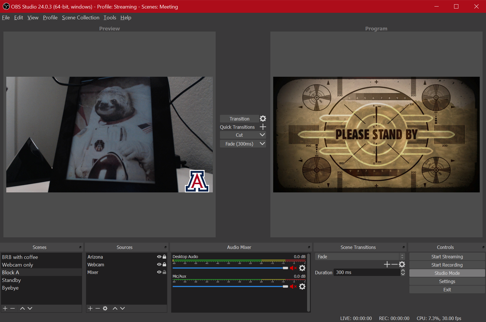
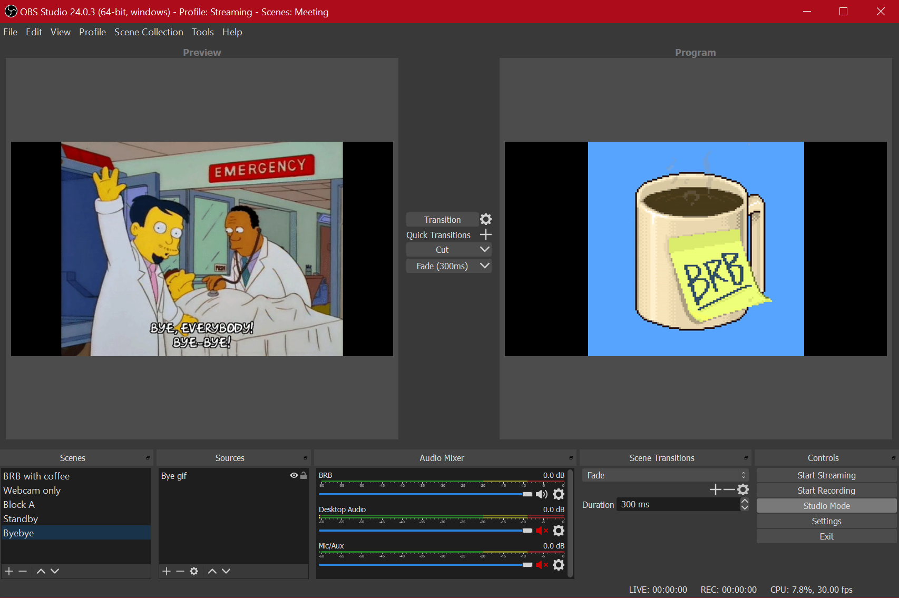

**UPDATE**: Using virtual cams broke in Zoom past version 4.6.7. Bummer.

**UPDATE 2**: Works again! Who knows how long it'll stay that way.

Seems like everybody I know is now working remotely due to the virtual worldwide lockdown in the face of the COVID-19 pandemic. Lots of folks that have little to no experience with it. And that's okay! We're all in this together. At this point, simple ettiquite and knowing how to mute your microphone should be considered passable skills. I shared a couple Twitter threads about teaching online but wanted to do something more tutorial-ish.

So, if you _are_ comfortable with working remotely and want to do something a bit more interesting than just, "Hey, look! I'm in a desert now!" well, this is for you.

## What you'll need

Presuming you already have a webcam and a microphone, this is all free. (Yay, right?) Here's the list of extra software you'll need to make this work.

+ [OBS Studio](https://obsproject.com/)

That's it. That's the list. Okay, you need the _VirtualCam_ plugin, but whatever.

### What is OBS Studio?

OBS stands for _Open Broadcaster Software_. It's one of the ways in which streamers do what they do. It's free, open source, and not the most user friendly thing, so... you take the good with the bad. Luckily, for our purposes, we don't need to do anything all that crazy. (That's another post in the future.) We're using OBS _Studio_ because it's the best for this situation for a few different reasons that I needn't go into here, really. Just trust me on this.

So, install OBS Studio and head into its Preferences to make sure you've got your settings configured properly. I'd suggest choosing either 1080 or 720 for your resolution. If you're using Zoom, while your live stream in the meeting may be in HD, any recording of it is likely set to be SD, so keep that in mind for later.

## Install the VirtualCam plugin

This is what makes the magic work. Head over to [the OBS forum for instructions on how to download and install the VirtualCam plugin](https://obsproject.com/forum/resources/obs-virtualcam.539/) for OBS. Use the _Go to download_ button on the top right.

Really, go do it. I'll wait. (You can choose just the single camera install option. I chose the 4 cameras but have never used more than one, so....)

### What does VirtualCam do?

Essentially, _VirtualCam_ takes your OBS output and turns it into a virtual camera that your meeting software can choose as a video input. Basically, instead of Zoom (for example) using your webcam, you can now use OBS. What does that mean? Well this is where it gets fun. Follow the instructions on the plugin page to get it going in OBS. 

## Beginner: Add a logo

A simple way to see what OBS can do for you here is just to add a logo to your webcam.

Just find the image you want (when using Google Image Search or whatever your preferred engine is, make sure to search for _Transparent_ images so your logo doesn't have a big solid background).

Now, let's get our first scene set up. Add your audio and video sources (microphone and webcam, respectively). Stretch the webcam source out to match the OBS canvas. Check your microphone to make sure the levels are active in the source monitor. 

Great, now at this point if we went into Zoom and switched the video source to _VirtualCam_, it would just be identical to what you'd normally see. You only have your webcam and microphone running. But that's not why we're here, is it?

Down in your sources, where you added your webcam and your microphone, add an _Image_ source. Find the transparent logo you downloaded and select that. Next, resize and move that puppy around on the screen to wherever you want it. Voila, you now have a logo on your webcam in Zoom!

Pretty easy, right?

## Intermediate: Add a BRB screen

Let's say you need to go away from the keyboard for a bit. Bathroom, feed the dogs, get coffee, whatever. Normally, in Zoom, you'd just turn off your video and audio. But why do that when we can have a bit more fun with it?

Here's what I put on the screen when I leave for a minute: 

And here's how to do it:

+ Head on over to [Giphy](https://giphy.com)
+ Find the thing you want to use for your BRB screen
+ Click on _Media_ and copy the MP4 link
+ Head on over to that URL, right click on the video, and _Save video as_ to whatever folder you want to keep this stuff in.
+ Open up OBS and create a new scene
+ For your source, add a Media Source or VLC Video Source (either works)[^1]
+ Choose that video file you downloaded
+ Stretch it out to fill or fit the canvas, whichever you want

And that's it! You're done! Just remember you also need to still mute yourself in your meeting software as this is _just_ a video source.

Switching to and from your scenes is easy and the Studio Mode in OBS Studio makes it pretty visually pleasing, as well. Simply hit the _Transition_ button in the middle of Studio Mode interface and it'll switch what's in the _Preview_ scene (left) to be what's sent to the _Program_ you're using (right). (That's what shows up in Zoom.) Like this:

## Advanced: Multiple screen elements

Check back in the future for a rundown on how I use OBS Studio in my online classes to include on-screen elements like scrolling due dates, realtime key-presses to support coding demonstrations, adding a cropped version of my camera feed over a slide deck, and more.

I'm just scratching the surface in terms of how this method of virtual presence can ramp up engagement in online classes but hopefully this post gives you everything you need to start playing with OBS Studio and (for example) Zoom to spice up what's likely to be a _lot_ of online meetings!

If you end up doing something you think is really neat, [tweet at me](https://twitter.com/ryanstraight) and let me know!

[^1]: If you're having difficulties with the sources, check out [the GitHub documentation](https://github.com/obsproject/obs-studio/wiki/Sources-Guide#vlc-video-source) for explanations.
