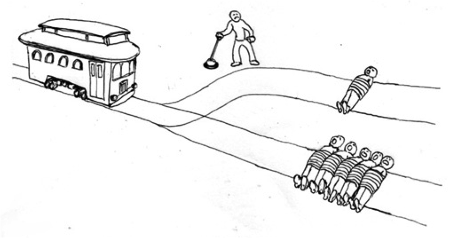
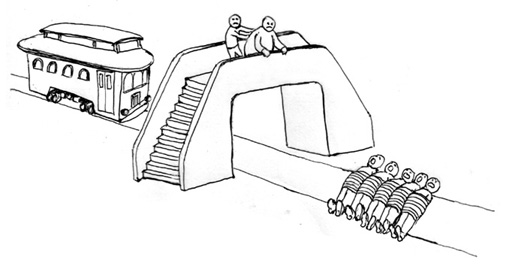

```{r presentationsetup, include=FALSE}
knitr::opts_chunk$set(echo = TRUE)
library(emo)
```

class: right, bottom, inverse

background-image: url(../standby.png)
background-position: center
background-color: #000
background-size: contain

<br /><h3 style="album">Destroyer - Kaputt (2011)</h3>

---
layout: true

<div class="my-header"></div>
<div class="my-footer"><span>HNRS 195: Cyborgs</span></div> 


---
class: left, middle, inverse

# HNRS 195: Cyborgs

## Dr. Ryan Straight

---

## Topics

+ Ethics
+ Expectations
+ Autonomous cars

---

<div style="width:100%;height:0;padding-bottom:54%;position:relative;"><iframe src="https://giphy.com/embed/FNui5ElRzRE0U" width="100%" height="100%" style="position:absolute" frameBorder="0" class="giphy-embed" allowFullScreen></iframe></div><p><a href="https://giphy.com/gifs/FNui5ElRzRE0U">via GIPHY</a></p>

---

# The Trolley Problem

---

```{r, out.width='100%', fig.align='center', echo=FALSE}

```


---

```{r, out.width='100%', fig.align='center', echo=FALSE}

```

---

# No-Win Situations

The Trolley Problem in the real world.

---

# Two options:

## 1. Behave like a human **would**

## 2. Behave like a human **should**

---

# Blame

# Bias

# Balgorithms

---

# Deep Learning

How does it work?

---

<div style="width:100%;height:0;padding-bottom:55%;position:relative;"><iframe src="https://giphy.com/embed/AMqCTHuCMFpM4" width="100%" height="100%" style="position:absolute" frameBorder="0" class="giphy-embed" allowFullScreen></iframe></div><p><a href="https://giphy.com/gifs/adventure-time-tired-bmo-AMqCTHuCMFpM4">via GIPHY</a></p>

---

# Deep Learning

We're not really sure.

(Specifically, on relevant decisions.)

---

# Agency

Do driverless vehicles have agency?

---

# Driveless car is involved in a crash. Who is responsible?

1. Those _inside_ the car.
1. Those who _designed_ the car.
1. Those who _manufactured_ the car.
1. The State (legal regulatory body)
1. The car (_algorithms_), itself.
1. ¯\_(ツ)_/¯


---

# Additional content

+ [Driverless Cars and Moral Philosophy](https://medium.com/@paddybettington/driverless-cars-moral-philosophy-3abe649a41d)
+ [A self-driving Uber car killed a pedestrian. Human drivers will kill 16 people today.](https://www.vox.com/science-and-health/2018/3/19/17139868/self-driving-uber-killed-pedestrian-human-drivers-deadly)
+ [The Ethics of Self-Driving Cars](https://www.youtube.com/watch?v=ozcaLnTuidU)
