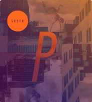

```{r presentationsetup, include=FALSE}
knitr::opts_chunk$set(echo = TRUE)
library(emo)
```

class: right, bottom, inverse

background-image: url(../standby.png)
background-position: center
background-color: #000
background-size: contain

<br /><h3 style="album">Postiljonen - Skyer  (2013)</h3>

---
layout: true

<div class="my-header"></div>
<div class="my-footer"><span>HNRS 195: Cyborgs</span></div> 


---
class: left, middle, inverse

# HNRS 195: Cyborgs

## Dr. Ryan Straight

---

## Topics

+ Ethics
+ Expectations
+ Autonomous cars

---

# What is a cyborg?

---

```{r, out.width='50%', fig.align='center', echo=FALSE}
knitr::include_graphics('hhttps://media.giphy.com/media/1388jPaZjhS4E0/giphy.gif')
```


---

---

# Resources

https://www.swipe.to/edit/51d3e5ff15874c9f87aa743c37a4139a
